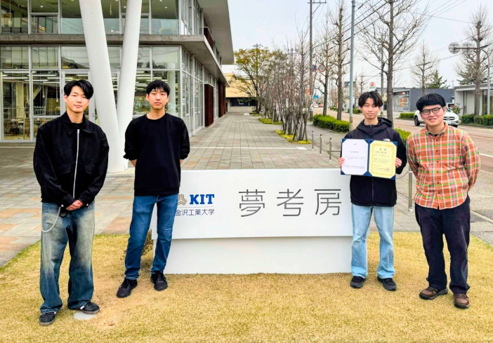
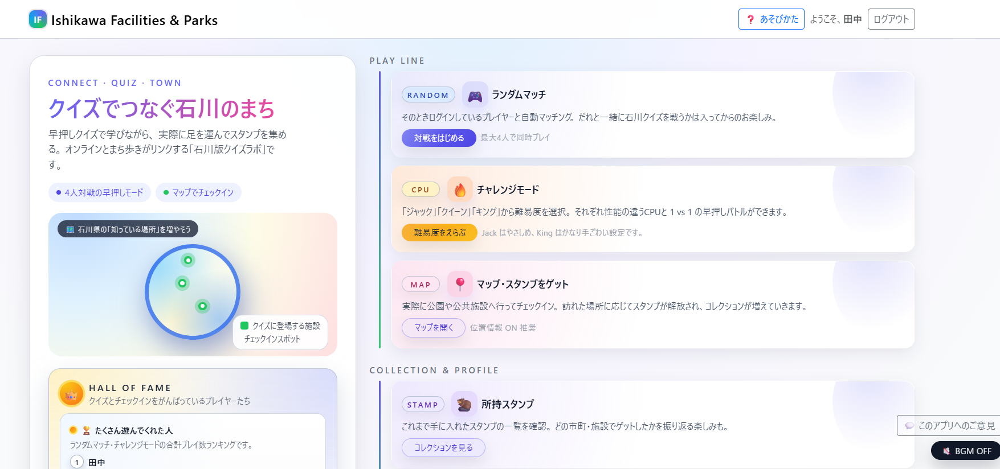
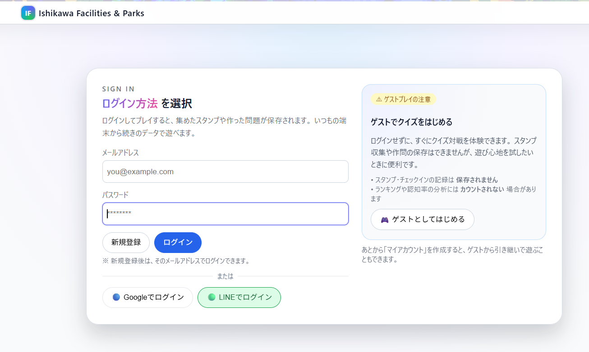
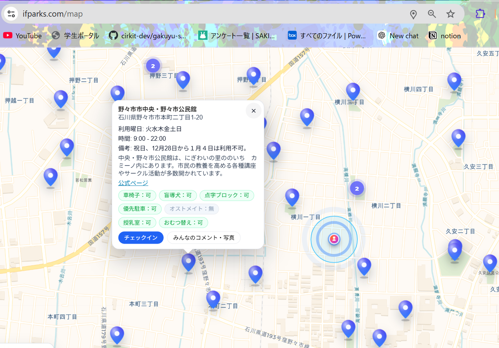
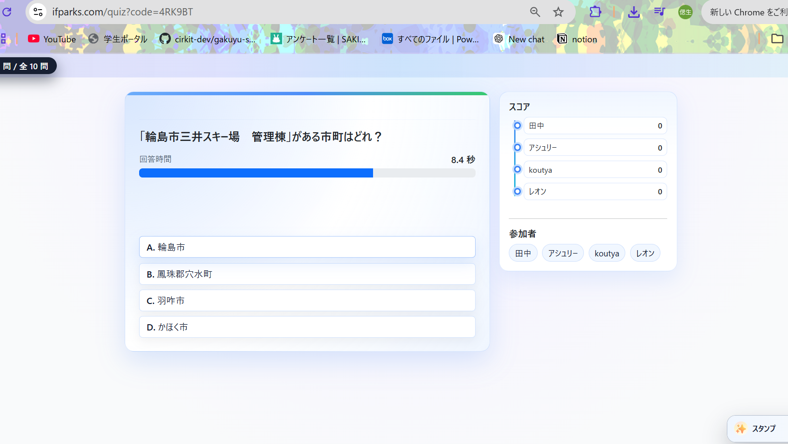
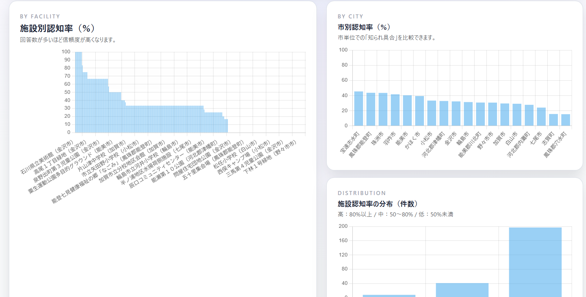
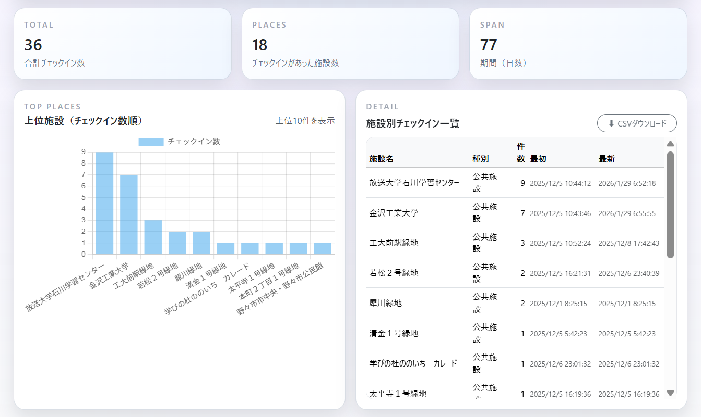
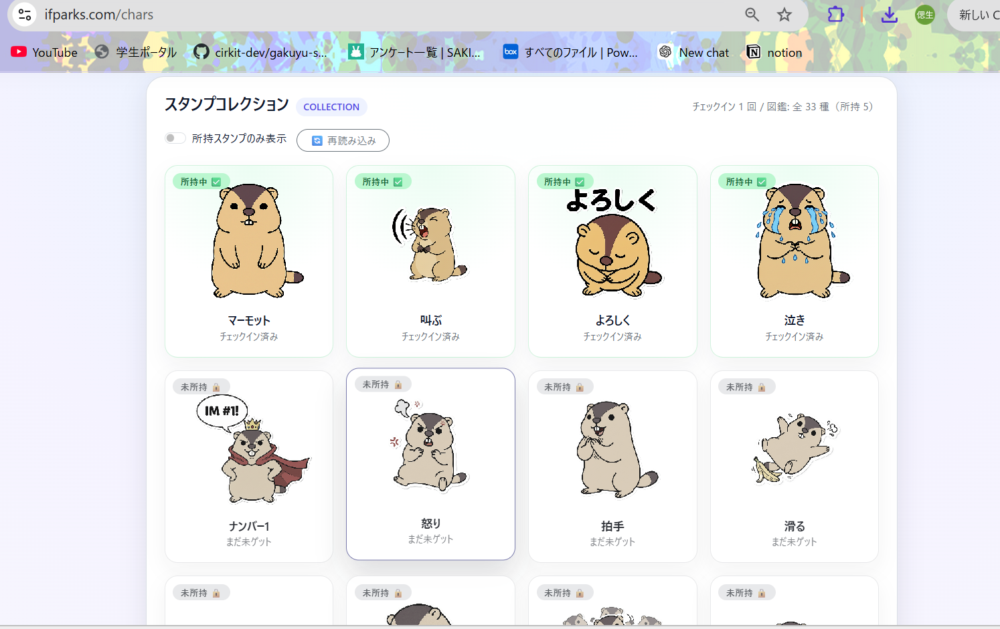

# Ishikawa Facilities & Parks

🏆 Urban Data Challenge 2025 銀賞 受賞作品（チーム金工大）

## ホーム画面

---

## 概要

「Ishikawa Facilities & Parks」は、クイズやチェックイン機能を通じて、石川県内の公共施設・公園を楽しく知ってもらうことを目的としたWebアプリケーションです。

ユーザーが遊びながら施設への認知を深めるだけでなく、利用データや認知率データを蓄積することで、自治体による地域分析や施設活用への応用を目指しています。

---

## 主な機能

- 公共施設・公園の地図表示
- 現在地取得機能
- チェックイン機能
- 写真投稿・コメント機能
- クイズ機能
- ランダムマッチ / フレンドマッチ
- スタンプ・キャラクター収集機能
- 利用状況の分析ダッシュボード
- ヒートマップによる可視化
- Google / LINE ログイン

---

## 使用技術

### Backend
- FastAPI
- SQLModel
- SQLite

### Frontend
- HTML
- CSS
- JavaScript
- Bootstrap

### Map / Visualization
- Leaflet
- Chart.js
- heatmap.js

### Authentication
- JWT Authentication
- Google OAuth
- LINE OAuth

### Infrastructure
- ConoHa VPS

---

## システムイメージ

### ログイン画面

### 地図機能

### クイズ機能

### 分析ダッシュボード（認知率分析）

### 分析ダッシュボード（行動履歴分析）

### スタンプ・コレクション機能

---

## 開発背景

地域の公共施設や公園は、多く存在していても十分に認知されていないケースがあります。

そこで、本アプリでは「遊び」を通じて施設への興味を高めることに着目し、クイズやチェックインなどのゲーミフィケーション要素を取り入れました。

また、ユーザー行動データを蓄積することで、自治体が地域施設の認知状況や利用傾向を分析できる仕組みを目指しています。

---

## 受賞歴

- Urban Data Challenge 2025 銀賞